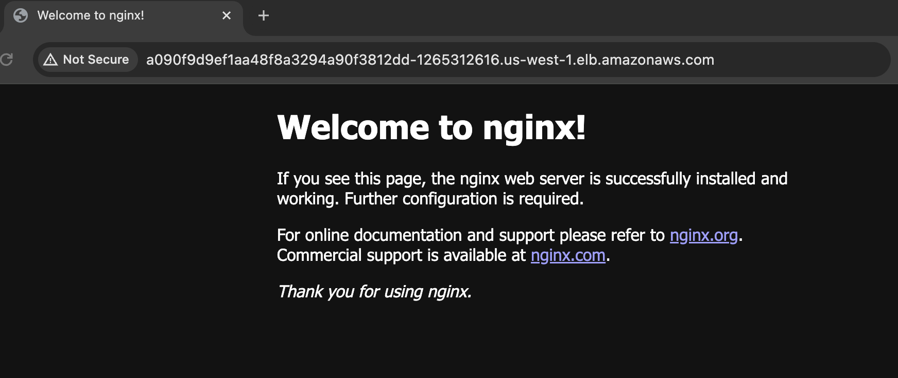

# aws-k8s

The following is an example of how to deploy an app to AWS EKS.

An example can be seen below:

## Required Software

- `eksctl`
- `awscli`
- `kubectl`

## Links

- [How to Make a Cluster](https://docs.aws.amazon.com/eks/latest/userguide/getting-started-eksctl.html)
- [How to Deploy an App](https://docs.aws.amazon.com/eks/latest/userguide/sample-deployment.html)

## Steps

1. Create a cluster: `eksctl create cluster -n my-cluster`
2. Deploy app: `kubectl apply -f deployment.yml`
3. Apply service: `kubectl apply -f service.yml`
4. List resources: `kubectl get all`
5. Visit the endpoint listed on the service, http, not https.
6. Delete cluster: `eksctl delete cluster -n my-cluster`
